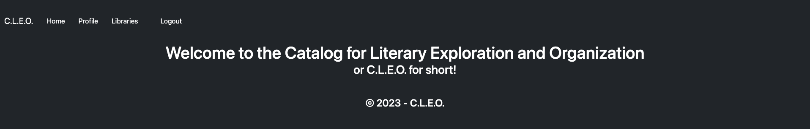

# Catalog for Literary Exploration and Organization or C.L.E.O.
  

  ## Description
  
  Library App for Teachers to Lend Out Books

  Try the app at [Here](https://cleobooks-c08c9ce9ac1e.herokuapp.com/)
  

  ## Table of Contents
  * [Installation](#installation)
  * [Usage](#usage)
  * [License](#license)
  * [Contribute](#contribute)
  * [Testing](#testing)
  * [Questions](#questions)
  
  ## Installation
  You will need to install the following to use this project

  see `package.json`

  ## Usage

  The use case for this project is Teachers have a personal library they would like to allow students to borrow from and need tracking for the books.

  ## License

  This Project is licensed under [MIT](https://opensource.org/licenses/MIT)

  ## Contribute

  If you would like the help contribute to this project contact GITHUB

  ## Testing

  To test this project do the following,

  clone the repo and perform installs

  ## Questions
  
  For any questions related to this project contact GITHUB 
  You can see more of our work on our Github Pages  
  [Olegreg762](https://github.com/Olegreg762) 
  [Brett-C](https://github.com/Brett-C) 
  [capydays](https://github.com/capydays) 
  [kevinatwood](https://github.com/kevinatwood)
